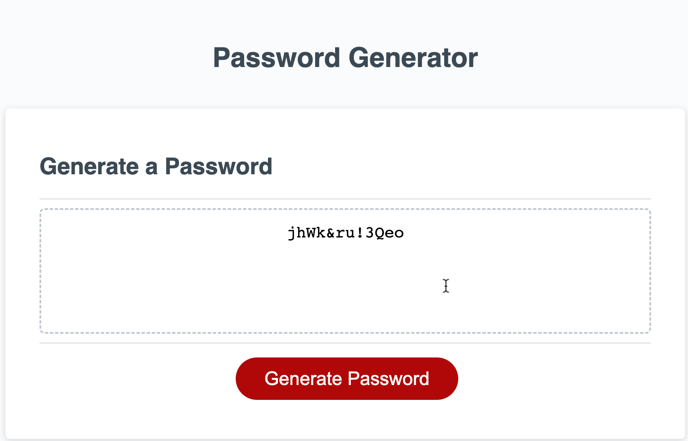

# Password-Generator

## Description

This is a password generator made for the purpose of its namesake -- generating a (strong, randomized) password with personalized criteria to the user's liking, which can be used to set up security for various technology platforms, be it accounts, files, etc. This password generator was crafted with HTML, CSS, and JavaScript.

The generator chooses from the capitalized alphabet, lowercased alphabet, numbers, and special keyboard characters of various punctuation. The generator pulls from these cateogories and shuffles the characters around to create a truly difficult password to crack, solving the problem of unsecure passwords.

In this challenge, I learned more about the syntax of JavaScript code, utilizing methods, when to use if statements or for loops, as well as how scope matters. I also learned how to think in JavaScript -- like describing each line of code as an actual English sentence in order to make sense of it all and why I want to do certain things and how to convey that in JavaScript-speak so the computer can understand what to do (eg: wrapping a formula in brackets next to an array name as to treat that formula to essentially be an index number).

I also learned how to create and utilize alert, confirm, and prompt boxes, as well as how to keep them looping when sufficient criteria is not met.

## Installation

N/A

## Usage

Upon landing on the page, when the user clicks "Generate Password," they will be presented with messages to confirm which criteria they would prefer to have included in their generated password: special characters, then numbers, then lowercase letters, then uppercase letters. They may click "OK" to include or "cancel" to exclude the proposed criteria.

Please see the following screenshots to see the user's POV:

If the user is being difficult, they will be alerted that they have to choose at least one criteria for the password generator, because otherwise, no password can be created!

After the user has selected the criteria they want in their password, they will be asked how many characters they want their password to be -- it must be at least 8 characters but no more than 128.

If they do not follow instructions (eg: choose a number less than 8, more than 128, or dont even include numbers), they will receive the following prompt repeatedly until they learn to follow basic instructions.

Once they enter a valid number, their password will be generated!

## Credits

Starter code was provided by edX.

## Project Repository

Please enjoy the deployed application [here](https://mintyry.github.io/pw-gen/)!